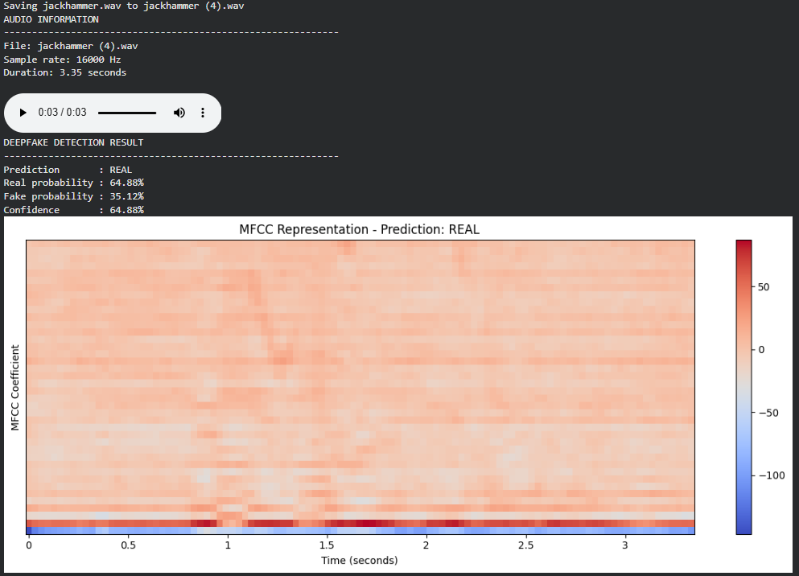

# Deepfake Audio Detection using CNN-BiLSTM

A deep learning system for classifying audio as real or synthetically generated using MFCC-based audio representations and a hybrid CNN-BiLSTM architecture.

## Objective

Detect synthetic speech by learning discriminative acoustic patterns from real and AI-generated audio.

## Dataset

- LJSpeech: 13,100 real audio samples
- WaveFake: 13,100 synthetic audio samples
- Total: 26,200 balanced samples
- Sampling rate: 16 kHz
- Features: 40 MFCC coefficients
- Input shape: 40 × 500

## Methodology

1. Load and resample audio to 16 kHz.
2. Extract 40-dimensional MFCC features using Librosa.
3. Pad or truncate features to a fixed 40 × 500 representation.
4. Train a CNN-BiLSTM binary classifier.
5. Evaluate using accuracy, precision, recall, F1-score, ROC-AUC, and confusion matrix.
6. Test the trained model on unseen audio files.

## Model Architecture

- 3 Conv2D blocks with Batch Normalization and MaxPooling
- 2 Bidirectional LSTM layers
- Dense layers with L2 regularization
- Dropout regularization
- Sigmoid output for binary classification
- Optimizer: Adam
- Loss: Binary Cross-Entropy

## Results

| Metric | Score |
|---|---:|
| Accuracy | 95.46% |
| Precision | 94.91% |
| Recall | 96.07% |
| F1-Score | 95.49% |
| ROC-AUC | 99.19% |

## Example

The model analyzes MFCC representations of audio and predicts whether the input is real or synthetically generated.

## Technologies

Python, TensorFlow/Keras, Librosa, NumPy, Scikit-learn, Matplotlib
